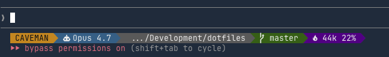

# ccrc — Claude Code Runtime Configuration

Opinionated Claude Code plugin. Powerline statusline with caveman badge, model, git, and token usage.



## What you get

- **CAVEMAN badge** — shown when [caveman plugin](https://github.com/JuliusBrussee/caveman) is active (detects `~/.claude/.caveman-active`)
- **Model** — current Claude model name
- **cwd** — working dir (auto-shortened when long)
- **Git** — branch + worktree marker when inside a linked worktree
- **Tokens** — total context usage as `{k}k {pct}%` (assumes 200k window)

## Requirements

- Terminal with a **Nerd Font** (for powerline glyphs)
- `python3` on `PATH` (used to parse session JSON)

## Install

```
/plugin marketplace add poberherr/ccrc
/plugin install ccrc@ccrc
```

A `SessionStart` hook symlinks the statusline script to `~/.claude/ccrc-statusline.sh` on every Claude Code launch (the plugin's install path is hashed and changes on update — the symlink gives you a stable target).

Then add this to `~/.claude/settings.json`:

```json
"statusLine": {
  "type": "command",
  "command": "bash ~/.claude/ccrc-statusline.sh"
}
```

One-time edit. Restart Claude Code.

> **Why the manual step?** Claude Code only honors `hooks`, `mcpServers`, `lspServers`, `monitors`, `agents`, and `skills` in plugin manifests — `statusLine` in `plugin.json` is silently ignored. And `${CLAUDE_PLUGIN_ROOT}` doesn't expand inside `~/.claude/settings.json`. The symlink hook bridges that gap.

### Upgrading from 0.1.0

0.1.0 shipped a `statusLine` block in `plugin.json` that Claude Code never read — so your bar was empty. 0.2.0 fixes that with the hook + manual `settings.json` edit above. Add the snippet and restart.

### Uninstall

```
/plugin uninstall ccrc@ccrc
rm ~/.claude/ccrc-statusline.sh
```

Also remove the `statusLine` block from `~/.claude/settings.json`.

## Customize

Edit the script directly after install:

```
~/.claude/plugins/cache/ccrc-ccrc/*/scripts/powerline-statusline.sh
```

Knobs at the top of the script:

- `C_*_BG` / `C_*_FG` — 256-color palette per segment
- `SEP`, `BRANCH`, `TREE` — Nerd Font glyphs
- Path-shortening threshold (default 30 chars)

Or fork the repo and point the marketplace at your fork.

## Caveman integration

When the caveman plugin flips `~/.claude/.caveman-active`, this bar prepends an orange `CAVEMAN` or `CAVEMAN:ULTRA` badge. No coupling — if caveman isn't installed, the segment is just omitted.

## License

MIT — see [LICENSE](LICENSE).
