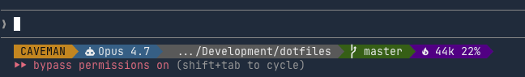

# ccrc — Claude Code Runtime Configuration

Opinionated Claude Code plugin. Two-line powerline statusline, plus a custom row for every running subagent.



## What you get

**Line 1 — identity and place**

- **Session name** — from `--name` or `/rename`, falling back to the short session id. Color is hashed from the name, so every pane looks different at a glance. This is the name other sessions address you by via `SendMessage`
- **Model** — display name, reasoning effort, and a ⚡ in fast mode
- **cwd** — working dir (auto-shortened when long)
- **Git** — branch (or short SHA when detached) + worktree marker
- **PR** — number and review state, as an OSC 8 hyperlink where the terminal supports it

**Line 2 — budget**

- **Context bar** — 12-cell bar, percentage, and `used/window`. Reads `context_window.used_percentage` from the payload, so it is correct on 1M-context models
- **Cost** — session spend in USD
- **Rate limits** — 5-hour and 7-day consumption
- **Mode badges** — `CAVEMAN` / `PONYTAIL` when those plugins are active (detects `~/.claude/.caveman-active`, `~/.claude/.ponytail-active`)

Both lines shift green → yellow → orange → red as usage climbs.

**Subagent rows** — `subagentStatusLine` replaces the default agent-panel row with status glyph, label, model·effort, token count and context percentage, elapsed time, and description, truncated to the panel width.

## Requirements

- Terminal with a **Nerd Font** (for powerline glyphs)
- `python3` on `PATH` (renders the statusline)
- Claude Code **v2.1.250+** for every field used here

## Install

```
/plugin marketplace add poberherr/ccrc
/plugin install ccrc@ccrc
```

A `SessionStart` hook symlinks the statusline script to `~/.claude/ccrc-statusline.sh` on every Claude Code launch (the plugin's install path is hashed and changes on update — the symlink gives you a stable target).

Then add this to `~/.claude/settings.json`:

```json
"statusLine": {
  "type": "command",
  "command": "bash ~/.claude/ccrc-statusline.sh"
}
```

One-time edit. Restart Claude Code.

> **Why the manual step?** Claude Code only honors `hooks`, `mcpServers`, `lspServers`, `monitors`, `agents`, and `skills` in plugin manifests — `statusLine` in `plugin.json` is silently ignored. And `${CLAUDE_PLUGIN_ROOT}` doesn't expand inside `~/.claude/settings.json`. The symlink hook bridges that gap.

Claude Code re-runs the statusline command on a new assistant message and on changes to token usage, permission mode, vim mode, model, fast mode, effort, thinking, and PR status — nothing else. Notably the session name is not a trigger, so `/rename mysession` on an idle session leaves the old name in the bar until the next message. (`/rename` with no argument generates the title with a model call, which moves token usage and refreshes the bar as a side effect.)

Add `refreshInterval` next to the command to re-run the bar on a timer as well, which closes that gap and keeps the bar live while the main session sits idle waiting on background subagents:

```json
"statusLine": {
  "type": "command",
  "command": "bash ~/.claude/ccrc-statusline.sh",
  "refreshInterval": 5
}
```

The subagent statusline needs no setup: a plugin's own `settings.json` is honored for exactly two keys, `agent` and `subagentStatusLine` — so ccrc ships one. It points at the same `~/.claude/` symlink, because `${CLAUDE_PLUGIN_ROOT}` is not substituted there either.

### Upgrading from 0.2.0

The bar is now two lines and reads everything from the statusline payload instead of parsing the transcript. Nothing to change — the `settings.json` command path is unchanged.

### Upgrading from 0.1.0

0.1.0 shipped a `statusLine` block in `plugin.json` that Claude Code never read — so your bar was empty. 0.2.0 fixes that with the hook + manual `settings.json` edit above. Add the snippet and restart.

### Uninstall

```
/plugin uninstall ccrc@ccrc
rm ~/.claude/ccrc-statusline.sh
```

Also remove the `statusLine` block from `~/.claude/settings.json`.

## Customize

Edit the script directly after install:

```
~/.claude/plugins/cache/ccrc-ccrc/*/scripts/statusline.py
~/.claude/plugins/cache/ccrc-ccrc/*/scripts/subagent-statusline.py
```

Knobs at the top of `statusline.py`:

- `NAME_COLORS` — palette the session-name color is hashed into
- `heat()` — the usage thresholds that drive the color shifts
- `G_*` — Nerd Font glyphs
- `short_cwd()` — path-shortening threshold (default 30 chars)

Test either script without launching Claude Code by piping it a payload:

```
echo '{"session_name":"lead","model":{"display_name":"Opus"},"context_window":{"used_percentage":42,"context_window_size":200000}}' \
  | bash scripts/powerline-statusline.sh
```

The badge logic has a self-check: `python3 scripts/test_statusline.py`.

Or fork the repo and point the marketplace at your fork.

## Mode-badge integration

When the caveman plugin flips `~/.claude/.caveman-active` or ponytail flips `~/.claude/.ponytail-active`, the bar prepends a badge (`CAVEMAN`, `CAVEMAN:ULTRA`, `PONYTAIL`). No coupling — if neither plugin is installed, the segments are just omitted.

Neither plugin clears its flag file on exit, so the flag alone would keep the badge lit after you disable the plugin. The bar cross-checks `enabledPlugins` in `~/.claude/settings.json` and stays dark when the plugin is gone. Note the badge only means *installed and enabled* — the modes themselves are injected once per session by a `SessionStart` hook, so a long session can drift out of them while the badge still burns.

## License

MIT — see [LICENSE](LICENSE).
